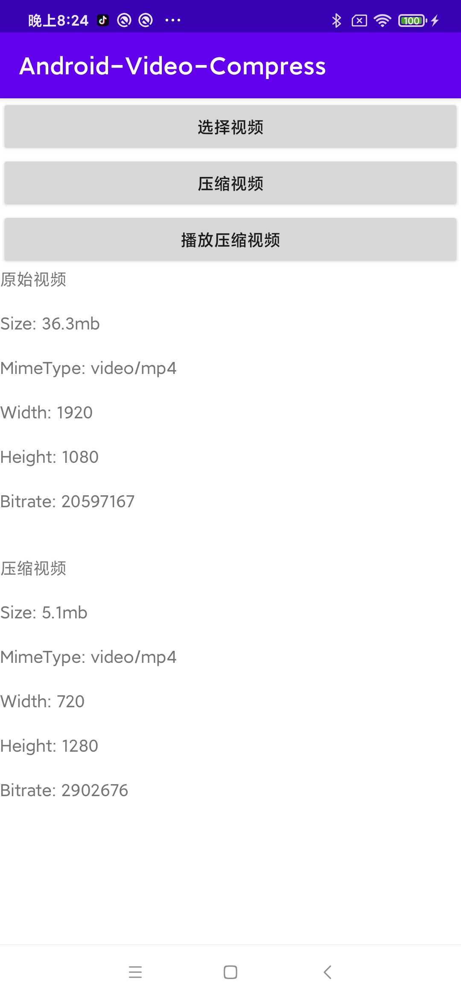

# Android-Video-Compress

基于Android MediaCodec实现的视频压缩工具，独特的视频质量计算方法高效压缩视频。



### 使用步骤

#### 1.下载AAR并添加到项目中。

[下载地址](https://github.com/zrheasy/Android-Video-Compress/releases/download/v1.0.0/video-compress-v1.0.aar)

```groovy
implementation fileTree(dir: 'libs', include: ['*.jar', '*.aar'])
```

#### 2.调用如下代码进行视频压缩。

```kotlin
// 使用uri的方式
VideoCompressUtils.compress(this, uri, outputDir, fileName, object : VideoCompressCallback {
    override fun onComplete(output: File) {
        // handle output
    }

    override fun onProgress(percent: Float) {
        // handle progress
    }

    override fun onError(code: Int, msg: String) {
        // handle error
    }
})

// 使用文件的方式
VideoCompressUtils.compress(input, outputDir, fileName, object : VideoCompressCallback {
    override fun onComplete(output: File) {
        // handle output
    }

    override fun onProgress(percent: Float) {
        // handle progress
    }

    override fun onError(code: Int, msg: String) {
        // handle error
    }
})
```

#### 3.视频质量计算算法。
- 先计算出分辨率的级别，然后进行降级，再计算出降级后的分辨率。
- 然后计算出比特率的质量，然后同样进行降级，再通过降级后的分辨率和比特率质量计算出最终的比特率。
- 最后在根据分辨率和比特率对原视频进行avc编码和MP4打包。